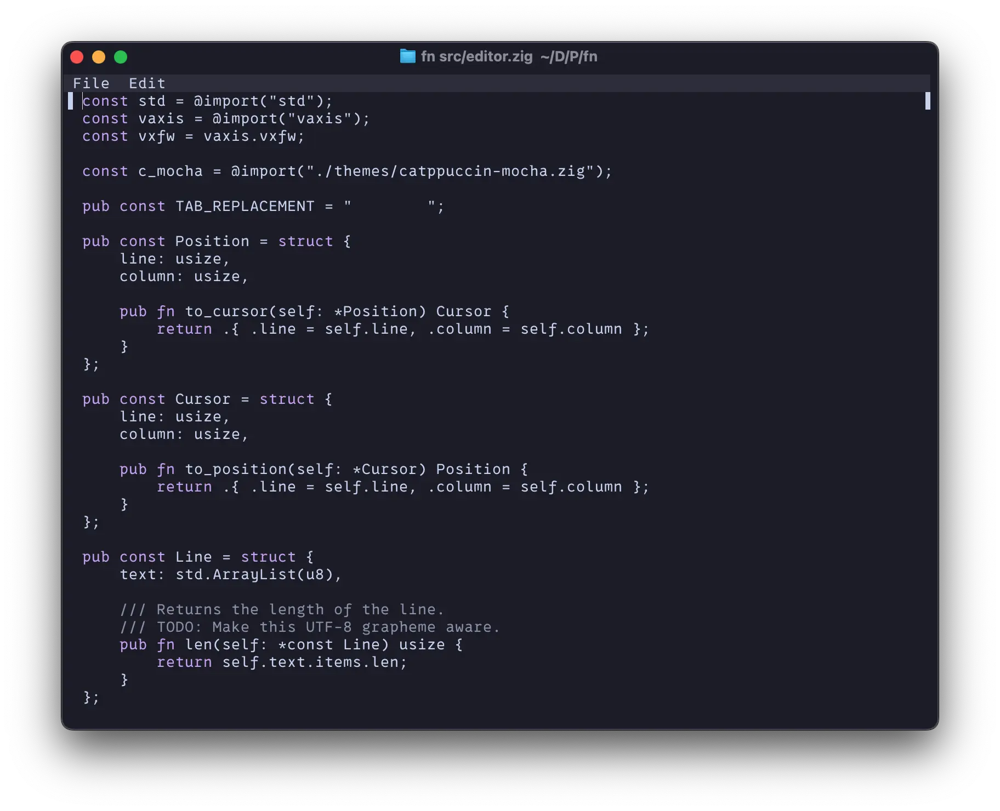

# ❄️ Fönn

[](https://github.com/reykjalin/fn/actions/workflows/tests.yml) [](https://builds.sr.ht/~reykjalin/fn/commits/main/tests.yml?)

This repo contains 2 projects: `libfn`, and Fönn. `libfn` is an editor engine that I'm working on for fun. Fönn is a code editor powered by `libfn`.

My primary goal is to eventually have a modern, capable TUI code editor that's powered by a reusable
editing engine. The engine itself will eventually be exposed as a static library with a C API, but
made in Zig. If I can get this project that far that is :)

A secondary goal is for `fn` to eventually have both a GUI and a TUI powered by this same text
editing "engine".

## Fönn (TUI)

❄️ Fönn: A code editor for _fun_.



This is currently a toy project, but `fn` is stable enough that I'm exclusively using it when working on changes to the editor.

My primary goal is to have a modern, capable TUI code editor.
A secondary goal is for `fn` to eventually have both a GUI and a TUI powered by the same text editing "engine".

### Build instructions

```sh
# Debug build in ./zig-out/bin/fn.
zig build

# Run debug build in current directory.
zig build run

# Open a file with debug build.
zig build run -- path/to/file

# Release build in ~/.local/bin/fn.
zig build --release=fast --prefix ~/.local
```

## Usage

```sh
$ fn --help
Usage: fn [file]

General options:

  -h, --help     Print fn help
  -v, --version  Print fn version

```

## libfn

If you're working on a Zig project and want to play around with the library itself you can do so by
installing fun with `zig fetch --save git+https://git.sr.ht/~reykjalin/fn`.

### Build instructions

```sh
# Make sure libfn builds.
zig build check

# Run tests.
zig build test
```

### Usage

```sh
$ zig fetch --save git+https://tangled.org/@reykjalin.org/fn
```

Then, in your `build.zig`:

```zig
const target = b.standardTargetOptions(.{});
const optimize = b.standardOptimizeOption(.{});

const libfn_dep = b.dependency("libfn", .{ .optimize = optimize, .target = target });

const root_module = b.createModule(.{
    .root_source_file = b.path("src/tui/main.zig"),
    .target = target,
    .optimize = optimize,
});

root_module.addImport("libfn", libfn_dep.module("libfn"));

const exe = b.addExecutable(.{
    .name = "example",
    .root_module = root_module,
});

b.installArtifact(exe);
```

and then you can import it in your code:

```zig
const libfn = @import("libfn");

// ...

const editor: libfn.Editor = .init(allocator);
```
